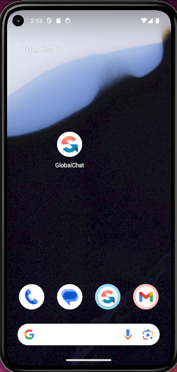
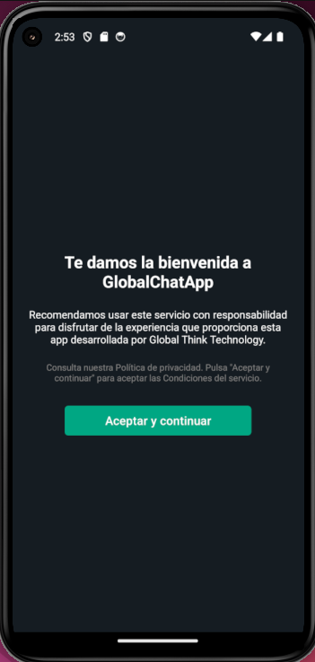
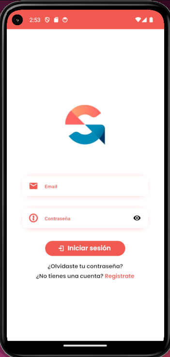

# GlobalChatApp








### Pasos para ejecutar el proyecto 📋

### Paso 1: Clonar el repositorio

Clona el repositorio en tu máquina local usando el siguiente comando:

```bash
git clone https://github.com/Leancba/globalChallenge.git
```

### Paso 2: Instalar dependencias

Navegar hasta la raiz del proyecto y ejecutar el siguiente comando

```bash
npm install.
```

### Paso 3: Compilar el proyecto

navega hasta la carpeta android y ejecuta el comando para compilar la aplicación

```bash
cd android
./gradlew build
```


### Paso 4: Ejecutar el proyecto

Si el paso anterior se ejecuto correctamente, navegar hasta el directorio raiz y ejecute el start

```bash
cd ..
npm start
```

## 🔐 Credenciales para ingresar a la aplicación

Una vez dentro de la aplicacion, podra ingresar a la misma con las siguientes credenciales:


- **Usuario**: challenge@gmail.com
- **Contraseña**: Contraseña12345_


## Librerias utilizadas 🛠️


* [Reac Hook Form](https://react-hook-form.com/) - Validación de formulario
* [React Native Paper](https://callstack.github.io/react-native-paper/) - Componentes UX/UI
* [React Navigation](https://reactnavigation.org/) - Navegación de pantallas
* [React Redux](https://react-redux.js.org/) - Gestion de estados globales


# Estructura del Proyecto

Este proyecto está organizado en las siguientes carpetas principales dentro del directorio `src`:

```bash
src
├── components      # Componentes reutilizables de la UI
├── helpers         # Métodos utilitarios y funciones compartidas
├── Redux           # Manejador de estado global con Redux
└── services        # Llamadas a APIs y manejo de servicios externos
```

# Funcionalidad de la Aplicación

### 1. **Inicio de Sesión**
- Los usuarios ingresan con su nombre de usuario y contraseña.

### 2. **Lista de Chats**
- Al iniciar sesión, los usuarios pueden ver una lista de todos los chats activos.

### 3. **Ingresar a un Chat**
- Los usuarios pueden seleccionar un chat de la lista para ver y enviar mensajes.

### 4. **Eliminar un Chat**
- Manteniendo presionado un chat, el usuario puede eliminarlo de la lista.

### 5. **Editar Perfil**
- Los usuarios pueden modificar sus datos de perfil (nombre, foto, etc.) desde la sección de perfil.


## 🛠 Soporte

Cualquier error de compilación u otro factor que impida ejecutar y/o compilar la aplicación, no dudes en comunicarte conmigo para poder ayudarte a ejecutar correctamente el proceso. ¡Muchas gracias!

